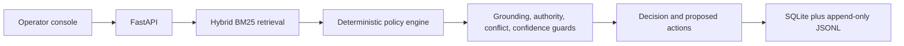
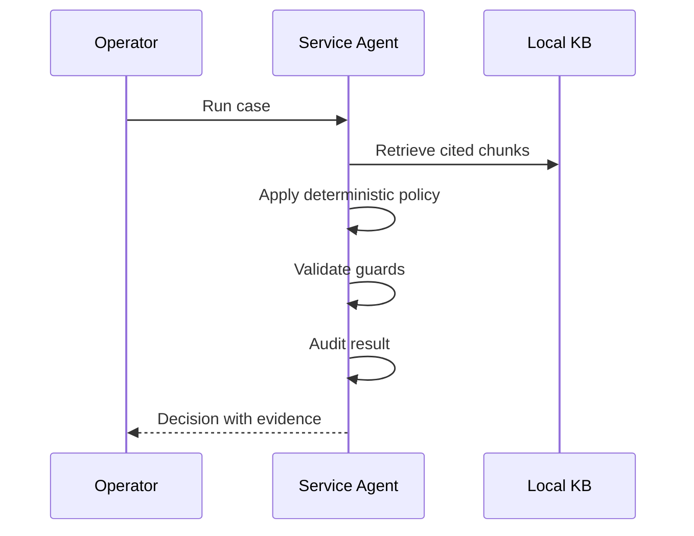

# Architecture

## Component contracts

`retriever.py` returns local KB chunks with scores. `policy_engine.py` produces the authority-aware preliminary `Decision`. `reasoner.py` may enrich language but the deterministic decision always wins. `guardrails.py` rejects uncited output, low-confidence automation, and unresolved policy conflicts. `audit.py` appends the input, evidence, trace, decision, and timestamp.

## Authority matrix

| Owner | Agent may do | Agent must not do |
| --- | --- | --- |
| IT | Known support instructions, approved fulfilment | Grant manager, Finance, or Security approvals |
| Manager | Receive approval requests | Be impersonated by the agent |
| Finance | Own asset exceptions and expense provisioning | Be bypassed for urgent requests |
| IT Security | Own software reviews and incident investigation | Have its review assumed or fabricated |
| Employee | Self-service actions and follow-up evidence | Receive invented remedies |

## Failure modes

The service routes when no policy supports a request. It exposes both sources when policies conflict. It uses the frozen date `2026-09-25 17:00 IST` for business-day calculations. It records proposed actions only, so an outage in downstream tools cannot create unauthorized side effects.
