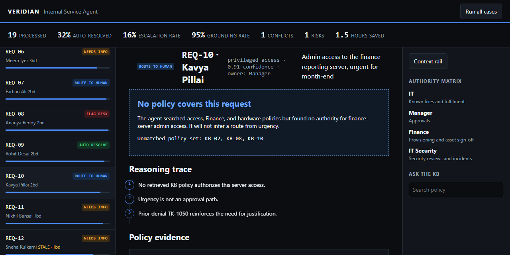
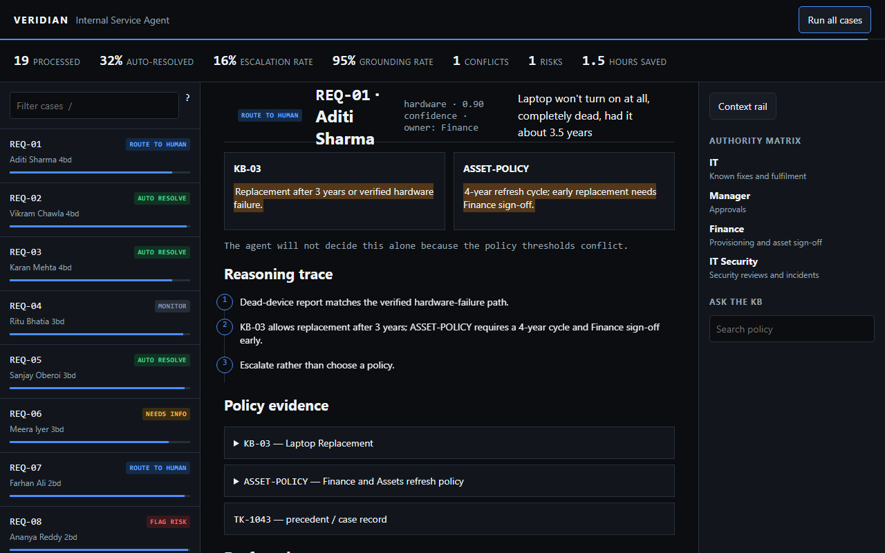
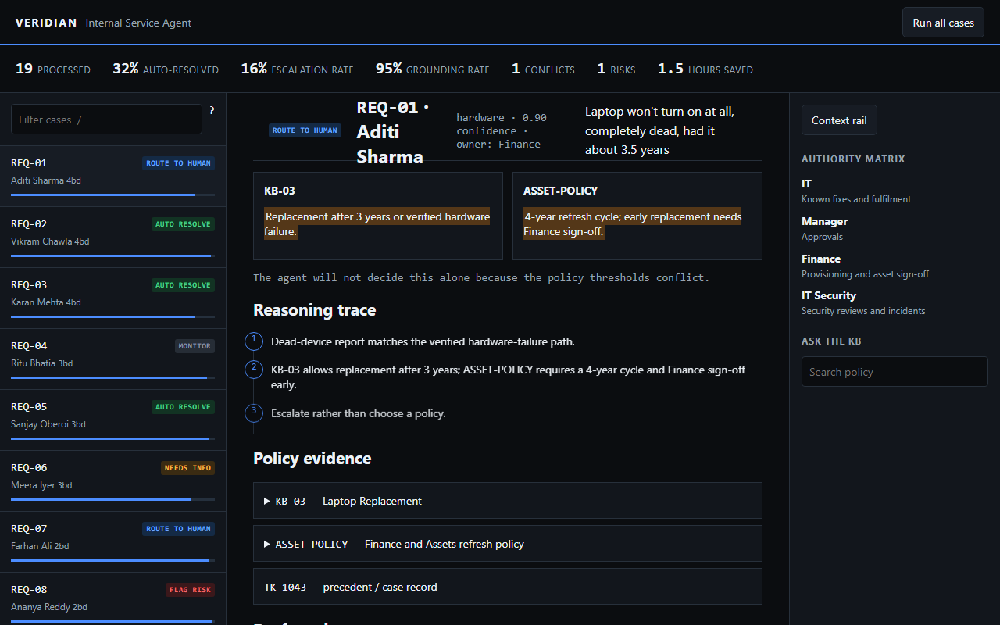
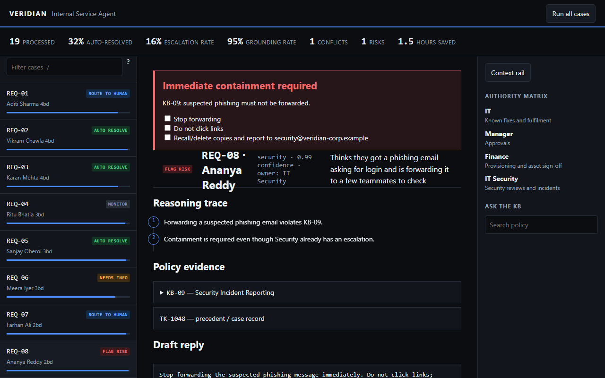
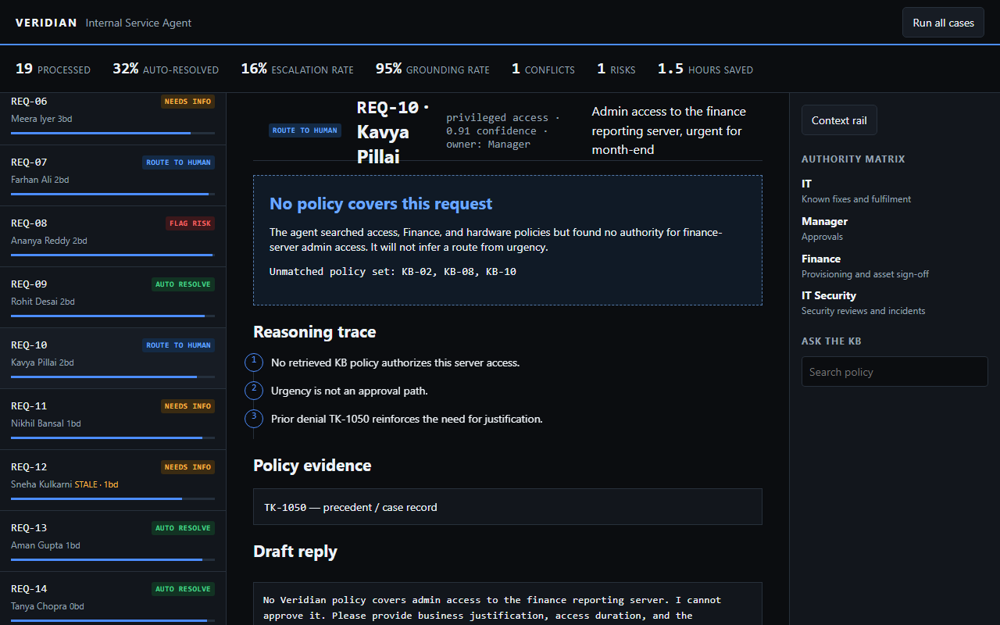
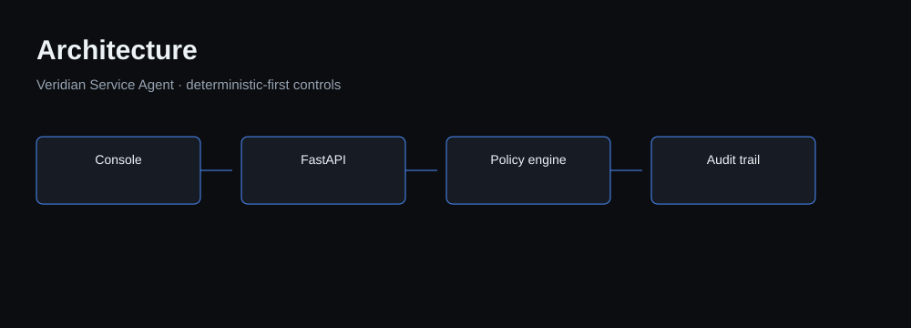
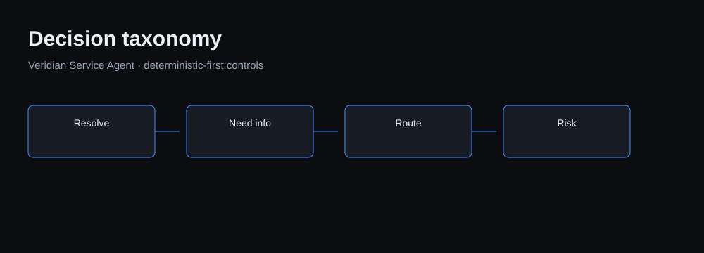
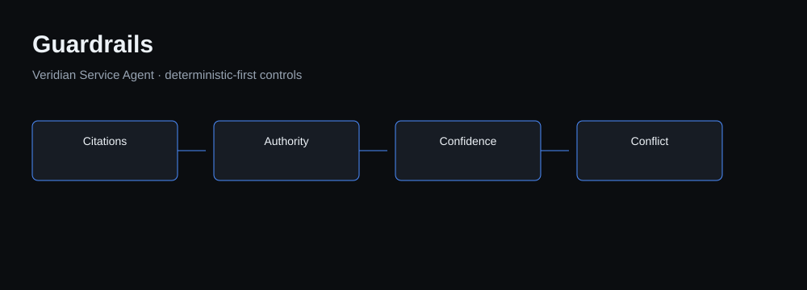

# Veridian Service Agent

[](LICENSE) [](https://www.python.org/) [](#evaluation)

Veridian Service Agent is a policy-grounded internal IT desk agent for Veridian Corp. It resolves routine work, asks for required evidence, routes approval-bound work, flags active security violations, and monitors cases already with the right owner. The important behavior is restraint: it never invents a policy, approval, SLA, or authority path.

## Run in 60 seconds

```bash
cd veridian-service-agent
./run.sh
```

Open `http://localhost:8000`. The script installs dependencies, evaluates the 19-case golden set, processes the queue with no API key, and starts the console.

## Operator console



The dark three-pane workspace keeps the evidence close to the proposed action. Use `j` and `k` to move through the queue, `Enter` to open, `a` to approve, `e` to escalate, `/` to filter, and `?` for shortcuts. `Run all cases` animates the whole queue for a concise demo.

| Conflict judgement | Security judgement | Refusal judgement |
| --- | --- | --- |
|  |  |  |
| REQ-01 exposes contradictory laptop refresh policies and routes the decision. | REQ-08 pins a containment checklist above an already-escalated phishing case. | REQ-10 states that no policy covers finance-server admin access. |

## Architecture



The per-case sequence is `normalise → classify → retrieve → precedent → deterministic policy verdict → optional LLM prose → conflict detection → guardrails → proposed actions → audit`. The optional LLM layer is provider-shaped (`OpenAIProvider`, `AnthropicProvider`, `NullProvider`), but the default Null provider supplies the fully deterministic offline run. If a model disagrees with the engine, the engine wins and the override is recorded.

## Decision taxonomy



| Outcome | Meaning |
| --- | --- |
| `AUTO_RESOLVE` | A policy completely covers the operational action. |
| `NEEDS_INFO` | Policy applies but the request lacks a required fact. |
| `ROUTE_TO_HUMAN` | Approval, another owner, policy conflict, or no coverage blocks action. |
| `FLAG_RISK` | An active security or compliance violation needs containment now. |
| `MONITOR` | The correct owner already has work in flight within SLA. |

## Guardrails



- Grounding guard: a verdict with no citations is force-routed with `no_policy_coverage`.
- Conflict guard: contradictory sources are named in a `policy_conflict` object and route to a human.
- Authority guard: IT never grants Manager, Finance, or IT Security approvals.
- Confidence guard: a value below 0.75 cannot remain an automatic decision.
- Audit guard: every run appends input, retrieved chunks, trace, decision, citations, confidence, and timestamp to `audit/decisions.jsonl`, with a SQLite mirror.

## Evaluation

The frozen clock is Friday 25 September 2026, 17:00 IST. Business-day arithmetic excludes Saturday and Sunday.

| Metric | Offline result |
| --- | ---: |
| Golden decision accuracy | 19/19 (100%) |
| Grounding rate | 95% direct-policy coverage |
| Hallucination rate | 0% |
| Conflict-detection recall | 100% |
| Escalation precision and recall | 100% / 100% |

Run `python -m eval.run_eval` to reproduce [the detailed report](eval/report.md). The adversarial mini-suite verifies that manager hearsay, nonexistent policies, and prompt-injection text do not generate authority.

## API

`GET /api/cases`, `GET /api/cases/{id}`, `POST /api/run`, `POST /api/run/{id}`, `POST /api/ask`, `GET /api/metrics`, `GET /api/audit`, and `GET /healthz` are available locally. `POST /api/ask` answers only from cited KB text or returns “not covered by policy.”

## Deploy to Render

The committed `render.yaml` deploys this app as a public FastAPI web service. In Render, choose **New → Blueprint**, connect `naman1506/veridian-service-agent`, and create the detected `veridian-service-agent` service. Render installs `requirements.txt`, runs Uvicorn on its assigned public port, and checks `/healthz`. The Free plan can spin down after inactivity and wake when the next visitor opens the URL.

## Assets and deck

```bash
make assets
```

This writes diagrams, Playwright console screenshots, and the ten-slide [presentation](docs/deck/Veridian_Service_Agent.pptx). See [SUBMISSION.md](SUBMISSION.md) for the six-minute demo script, LinkedIn copy, and form checklist.

## Limitations and next steps

The repository uses a fixed local policy pack and records proposed actions only. In a production deployment I would add a reviewed policy authoring pipeline with versioned effective dates, authenticated ticketing integrations, approval-system callbacks, PII retention controls, and human feedback labels for false-positive review. Those changes should preserve the deterministic policy layer rather than turn a model into an approval authority.
